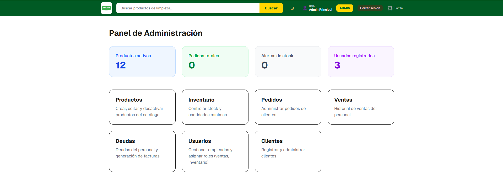
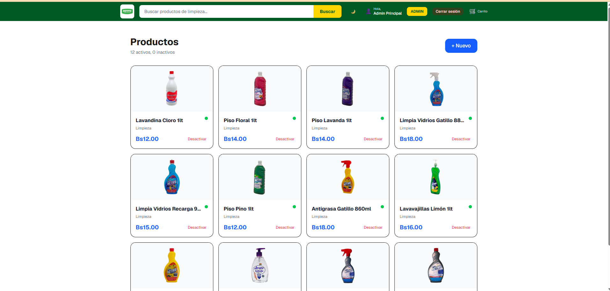
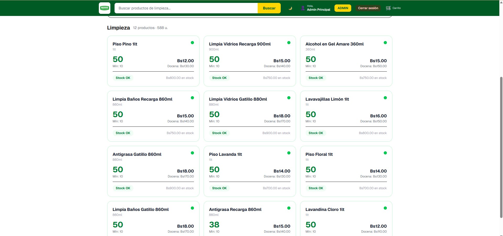
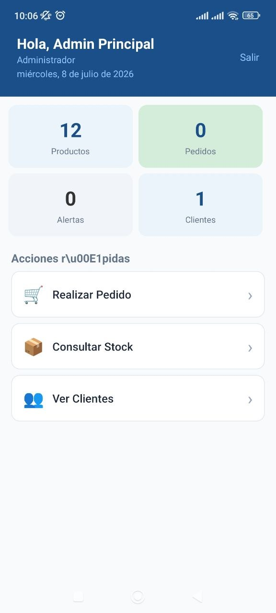
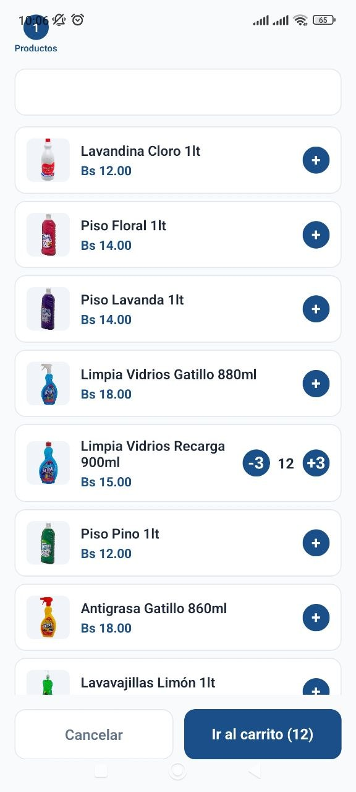

# 🛒 Sistema de Ventas Full Stack

Sistema Full Stack para la gestión de ventas e inventario desarrollado con arquitectura moderna. El proyecto está compuesto por una aplicación web, una API REST y una aplicación móvil para la gestión comercial.

---

# 🚀 Tecnologías

## Frontend
- Next.js
- React
- TypeScript
- Tailwind CSS

## Backend
- NestJS
- TypeORM
- PostgreSQL
- JWT
- Swagger

## Mobile
- React Native
- Expo

## Base de Datos
- PostgreSQL

---

# 📂 Estructura

```text
sistema-ventas-fullstack
│
├── frontend
├── backend
├── mobile
└── docs
    └── Screenshots
```

---

# 📸 Capturas

## Landing


---

## Dashboard



---

## Productos



---

## Inventario



---

## Usuarios


---

# 📱 Aplicación móvil

### Dashboard



### Productos


### Pedidos



### Inventario


### Clientes


---

# ✨ Funcionalidades

- Inicio de sesión
- Dashboard administrativo
- Gestión de productos
- Gestión de categorías
- Gestión de clientes
- Gestión de usuarios
- Inventario
- Pedidos
- Reportes
- API REST
- Aplicación móvil
- Responsive Design

---

# ⚙️ Instalación

## Clonar

```bash
git clone https://github.com/tiburoncin1599/sistema-ventas-fullstack.git
```

---

## Frontend

```bash
cd frontend
npm install
npm run dev
```

---

## Backend

```bash
cd backend
npm install
npm run start:dev
```

---

## Mobile

```bash
cd mobile
npm install
npx expo start
```

---

# 👨‍💻 Autor

**Andres Angel Aguirre Saravia**

- GitHub: https://github.com/tiburoncin1599
- LinkedIn: https://www.linkedin.com/in/andres-angel-aguirre-saravia-327269379/

---

⭐ Si este proyecto te gustó, puedes darle una estrella en GitHub.